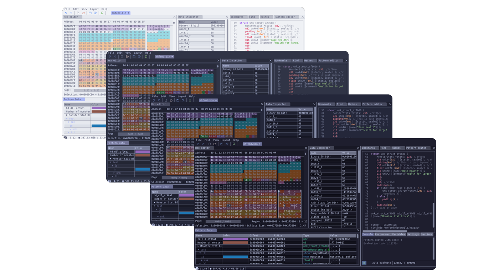
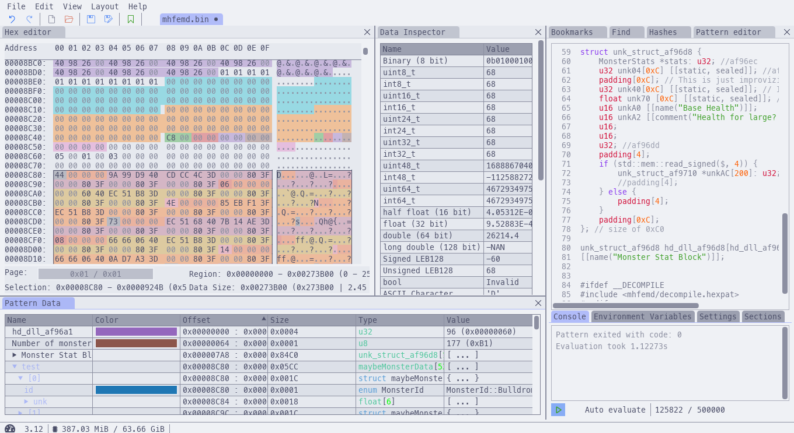
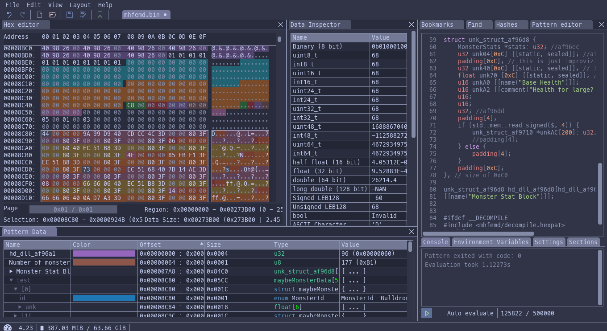
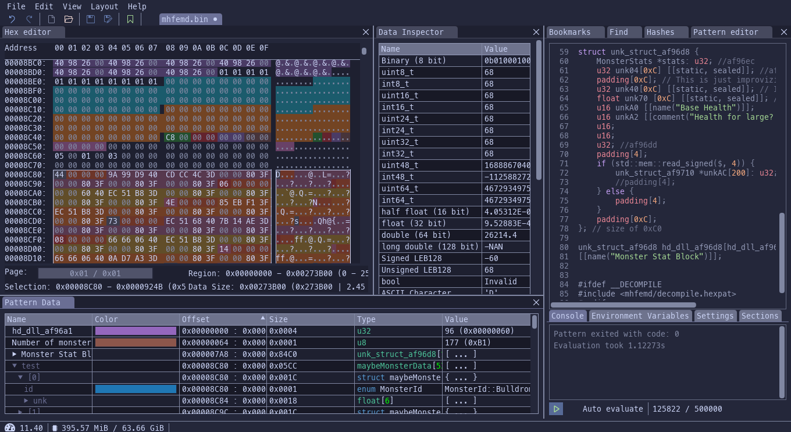
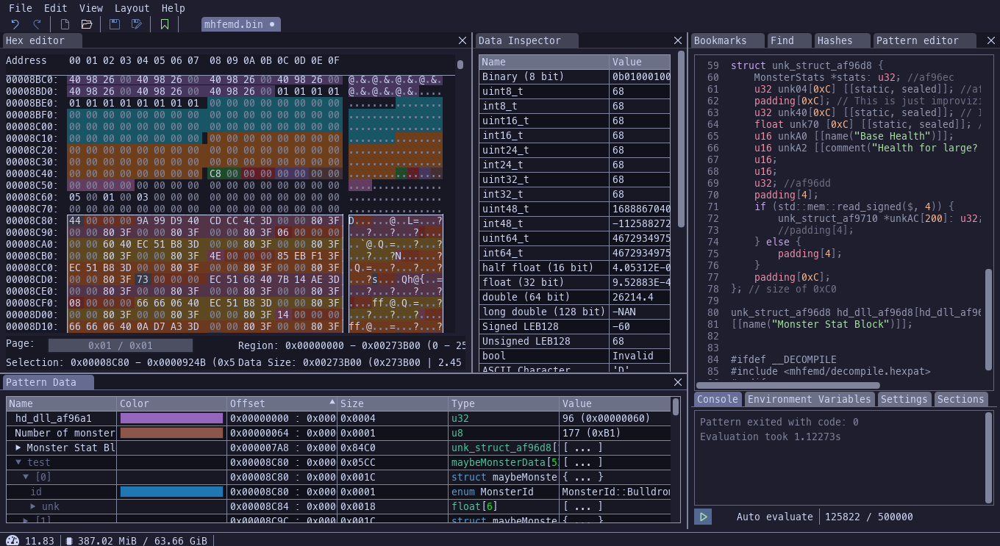

<h3 align="center">
	 
	
	Catppuccin for <a href="https://imhex.werwolv.net/">ImHex</a>
	
</h3>

	
	
	

	

## Previews

🌻 Latte

🪴 Frappé

🌺 Macchiato

🌿 Mocha

## Usage

1. Download your preferred flavour from the
   [latest release](https://github.com/catppuccin/imhex/releases/latest) or
   from the [latest build](https://github.com/catppuccin/imhex/actions/workflows/build.yml).
2. Move the `catppuccin-*.json` files into:
    - **Windows**: `%LocalAppData%\imhex\themes`
    - **Linux**: `~/.local/share/imhex/themes`

   If these directories don't work for you, please check what paths are detected in ImHex via:  
   `Help -> About -> ImHex Directories -> Themes`.
3. In **ImHex**: `Help -> Settings -> Interface -> Color Theme -> (your preferred flavour)`

## 🙋 FAQ

- Q: **_"What is the font used in the preview?"_**\
  A: [MesloLGS NF](https://github.com/romkatv/powerlevel10k#how-was-the-recommended-font-created) with font size set to 16.

- Q: **_"Where is the code used in the preview from?"_**\
  A: The sample code comes from [this repository](https://github.com/var-username/Monster-Hunter-Frontier-Patterns).

## 👐 Contributing

1. Install requirements via `pip install -r requirements.txt`
2. Generate the JSON files via `python src/catppuccinator.py`. The files will be generated under the `build/` directory.

## 💝 Thanks to

- [Doriel Rivalet](https://github.com/DorielRivalet)

&nbsp;

	

	Copyright &copy; 2021-present <a href="https://github.com/catppuccin" target="_blank">Catppuccin Org</a>

	

