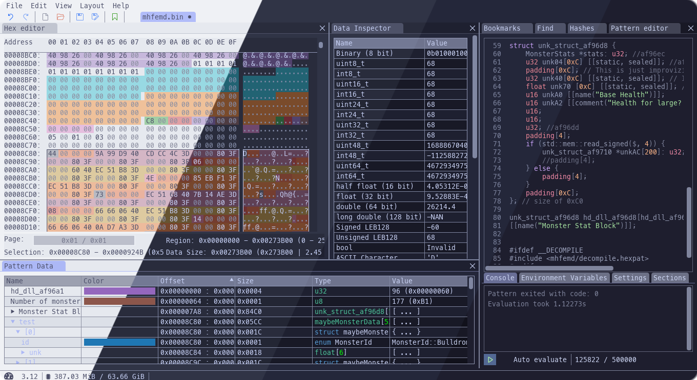

<h3 align="center">
	 
	
	Catppuccin for <a href="https://imhex.werwolv.net/">ImHex</a>
	
</h3>

	
	
	

	

## Previews

🌻 Latte

🪴 Frappé

🌺 Macchiato

🌿 Mocha

## Usage

### Manual Installation

1. Clone this repository locally
2. Open `%LocalAppData%\imhex\themes`
3. Drag the `.json` files into the `themes` folder
4. In *ImHex*: Help > Settings > Interface > Color Theme > *(your preferred flavor)*

## 🙋 FAQ

- Q: **_"What is the font used in the preview?"_**\
  A: [MesloLGS NF](https://github.com/romkatv/powerlevel10k#how-was-the-recommended-font-created) with font size set to 16.

- Q: **_"Where is the code used in the preview from?"_**\
  A: The sample code comes from [this repository](https://github.com/var-username/Monster-Hunter-Frontier-Patterns).

	

## 💝 Thanks to

- [Doriel Rivalet](https://github.com/DorielRivalet)

&nbsp;

	

	Copyright &copy; 2021-present <a href="https://github.com/catppuccin" target="_blank">Catppuccin Org</a>

	

